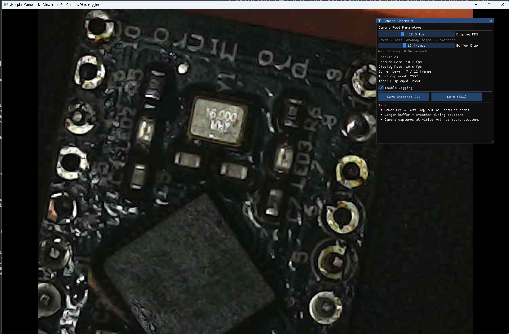

# ⚠️⚠️ This is vibe coded like crazy - use at own risk ⚠️⚠️

This project is vibe coded like crazy because I got a wadeo digital microscope for my sideprojects at home - found out that they didn't support Windows way later than I should have realised.

Found a repository on github that built a driver for the linux kernel so I forked it and went to work from there.

You can find the original code here 
**Originally derived from:** [MAkcanca/useeplus-linux-driver](https://github.com/MAkcanca/useeplus-linux-driver)

This is not my finest work, I am not a driver developer at all, even if I know what is going on ehre I didn't want to spend time on it myself right now. 



# Useeplus Camera Driver for Windows

Windows port of the Useeplus SuperCamera (VID: 0x2ce3, PID: 0x3828) driver using WinUSB.

**Originally derived from:** [MAkcanca/useeplus-linux-driver](https://github.com/MAkcanca/useeplus-linux-driver/blob/main/supercamera_simple.c)

This Windows port includes significant architectural changes and improvements. See [CHANGELOG.md](CHANGELOG.md) and [docs/IMPROVEMENTS.md](docs/IMPROVEMENTS.md) for details.


## Download Pre-built Binaries

Don't want to build from source? Download the latest pre-built binaries:

1. Go to the [Actions tab](../../actions)
2. Click on the latest successful workflow run
3. Download the `useeplus-camera-Release-*` artifact
4. Extract and run!

Alternatively, if there's a release available, download from [Releases](../../releases).

## Project Structure

```
root/
├── src/                    # Library source code
│   └── useeplus_camera.c   # Main driver implementation
├── include/                # Public headers
│   └── useeplus_camera.h   # Driver API
├── examples/               # Example applications
│   ├── camera_capture.c    # Simple frame capture example
│   ├── live_viewer.cpp     # GDI+ based live viewer
│   └── live_viewer_imgui.cpp # Advanced viewer with adjustable controls
├── tools/                  # Diagnostic and testing tools
│   ├── diagnostic.c        # USB device enumeration
│   ├── simple_winusb_test.c # WinUSB testing tool
│   ├── simple-test.c       # Basic connectivity test
│   └── supercamera_simple.c # Legacy test
├── docs/                   # Documentation
│   ├── README_WINDOWS.md
│   └── WINDOWS_PORT_SUMMARY.md
├── build/                  # CMake build output (gitignored)
├── CMakeLists.txt         # Build configuration
├── build.ps1              # Quick build script (PowerShell)
└── README.md              # This file
```

## Quick Start

### 1. Install WinUSB Driver

Use [Zadig](https://zadig.akeo.ie/):
1. Plug in camera
2. Open Zadig
3. Select "Useeplus SuperCamera" Interface 1
4. Install WinUSB driver

### 2. Build

**PowerShell (recommended):**
```powershell
.\build.ps1
```

**Manual build (any shell):**
```cmd
mkdir build
cd build
cmake .. -G "Visual Studio 17 2022"
cmake --build . --config Release
```

### 3. Run

All executables will be in `build/Release/`:

- **live_viewer_imgui.exe** - Advanced viewer with adjustable controls (recommended)
- **live_viewer.exe** - Simple viewer
- **camera_capture.exe** - Capture frames to files
- **diagnostic.exe** - Check USB device status

## Features

### Live Viewer with ImGui Controls

The advanced viewer (`live_viewer_imgui.exe`) provides:
- **Adjustable Display FPS** (5-30 fps) - Control latency vs smoothness
- **Buffer Size Control** (2-32 frames) - Tune frame smoothing
- **Real-time Statistics** - Capture rate, display rate, buffer level
- **Enable/Disable Logging** - Toggle frame timing logs
- **Interactive UI** - Adjust parameters without recompiling

**Controls:**
- `H` - Toggle controls UI
- `S` - Save snapshot
- `ESC` - Exit

### Frame Smoothing

Both viewers implement frame smoothing to eliminate visible stutters caused by the camera's periodic keyframe generation:
- Camera captures at ~16fps with 600ms stutters every 16 frames
- Circular buffer absorbs timing irregularities
- Displays frames at consistent rate
- Adjustable latency/smoothness tradeoff

### Camera Reopening

Improved USB cleanup allows reopening the camera without replugging:
- Proper pipe abort/flush/reset sequence
- Alternate setting management
- State clearing between sessions

## API Example

```c
#include "useeplus_camera.h"

// Open camera
CAMERA_HANDLE camera = camera_open();

// Start streaming
camera_start_streaming(camera);

// Read frames
unsigned char buffer[1024*1024];
size_t bytes_read;
while (running) {
    if (camera_read_frame(camera, buffer, sizeof(buffer), &bytes_read, 1000) == CAMERA_SUCCESS) {
        // Process JPEG frame in buffer
    }
}

// Cleanup
camera_stop_streaming(camera);
camera_close(camera);
```

## Building Your Own Application

Link against `useeplus_camera.dll`:

```cmake
target_link_libraries(your_app useeplus_camera)
```

Include the header:
```c
#include "useeplus_camera.h"
```

## Requirements

- Windows 10/11
- Visual Studio 2022 or later
- CMake 3.10+
- WinUSB driver (via Zadig)

## Known Limitations

- **Camera stutters every 16 frames** - Hardware limitation (600ms keyframe generation)
  - Use frame smoothing to hide visible stuttering
  - Adjust buffer size vs latency tradeoff in ImGui viewer
- **First frame may be corrupted** - Flush first few frames
- **Windows-only** - Uses WinUSB API

## Troubleshooting

**Camera not detected:**
- Check Zadig installed WinUSB on Interface 1 (not Interface 0)
- Try different USB port
- Check Device Manager for errors

**Can't reopen camera:**
- Wait 2-3 seconds between close and reopen
- Try unplugging and replugging if issue persists

**Corrupted frames:**
- First few frames after opening may be corrupt (expected)
- If persistent, check USB cable quality

### Debug Logging

If you're experiencing issues, enable debug logging to capture detailed diagnostic information:

**Enable via environment variable** (affects all applications):
```cmd
set USEEPLUS_DEBUG=1
live_viewer.exe
```

**Enable via command-line flag** (per application):
```cmd
live_viewer.exe --debug
live_viewer_imgui.exe -d
camera_capture.exe --debug
```

**Enable via API** (in your own code):
```c
camera_set_debug_logging(true);
```

Debug logs are written to `useeplus_debug.log` in the current directory and include:
- USB device operations (open, close, enumerate)
- Streaming start/stop events
- Frame capture with timestamps and sizes
- USB errors and timeouts
- Frame drops and buffer overflows
- Detailed error messages

**When reporting issues**, please include:
1. The `useeplus_debug.log` file
2. The `frame_timing.log` file (if using a viewer)
3. Description of the problem
4. Windows version and USB chipset info

See [Debug Logging Guide](docs/DEBUG_LOGGING.md) for complete documentation.

## Performance Tips

For best results in `live_viewer_imgui.exe`:
- **Low latency:** 20+ fps display, small buffer (2-4 frames)
- **Smooth playback:** 10-12 fps display, larger buffer (12-20 frames)
- **Balanced:** 14-16 fps display, medium buffer (6-10 frames)

## License

This project is licensed under GPLv3, maintaining the same license as the [original Linux driver](https://github.com/MAkcanca/useeplus-linux-driver).

See [LICENSE](LICENSE) file for details.

## See Also

- [Debug Logging Guide](docs/DEBUG_LOGGING.md) - Complete debug logging documentation
- [CHANGELOG](CHANGELOG.md) - Detailed list of all improvements and changes
- [Code Improvements Summary](docs/IMPROVEMENTS.md) - High-level overview of major fixes
- [Windows Port Summary](docs/WINDOWS_PORT_SUMMARY.md) - Original port documentation
- [Windows-specific README](docs/README_WINDOWS.md) - Windows setup details
